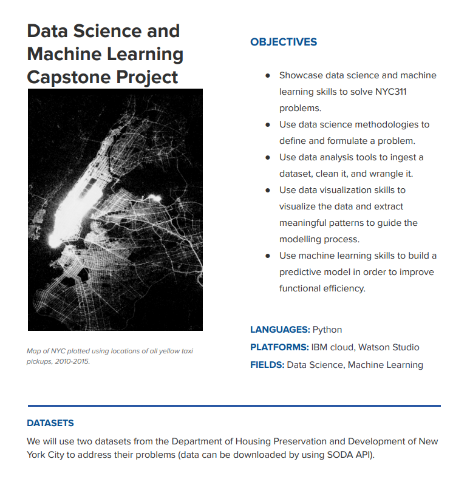

* NYC 311 Complaint Dataset  
https://nycopendata.socrata.com/Social-Services/311-Service-Requests-from-2010-to-Present/erm2-nwe9

* Pluto Dataset for Housing   
https://www1.nyc.gov/site/planning/data-maps/open-data/dwn-pluto-mappluto.page

### Problem Statement
The people of New Yorker use the 311 system to report complaints about the non-emergency
problems to local authorities. Various agencies in New York are assigned these problems. The
Department of Housing Preservation and Development of New York City is the agency that
processes 311 complaints that are related to housing and buildings.  
In the last few years, the number of 311 complaints coming to the Department of Housing
Preservation and Development has increased significantly. Although these complaints are not
necessarily urgent, the large volume of complaints and the sudden increase is impacting the
overall efficiency of operations of the agency.
